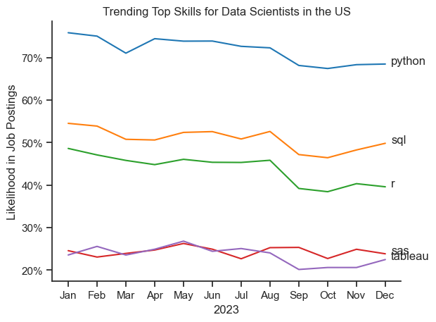

# The Analysis

## 1. What are the most demanded skills for the top 3 most popular data roles?

To find the most demanded skills for the top 3 most popular data roles, I filtered out those positions by which ones were the most popular, and got the top 5 skills for these top 3 roles. This query highlights the most popular job titles and their top skills, showing which skills I should pay attention to depending on the role I'm targeting.

View my notebook with detailed steps here: [2_Skills_Count.ipynb](3_Project/2_Skills_Count.ipynb)

### Visualize Data

```python
fig, ax = plt.subplots(len(job_titles), 1)

for i, job_title in enumerate(job_titles):
    df_plot = df_skills_percent[df_skills_percent['job_title_short'] == job_title].head(5)
    sns.barplot(data=df_plot, x='skill_percent', y='job_skills', ax=ax[i], hue='skill_count', palette='dark:b_r')
    ax[i].set_title(job_title)
    ax[i].set_ylabel('')
    ax[i].set_xlabel('')
    ax[i].get_legend().remove()
    ax[i].set_xlim(0, 78)

plt.show()
```

### Results


### Insights

- Python is a versatile skill, highly demanded across all three roles, but most prominently for Data Scientists (72%) and Data Engineers (65%). 
- SQL is the most requested skill for Data Analysts and Data Scientists, with it in over half the job postings for both roles. For Data Engineers, Python is the most sought after skill, appearing in 68% of job postings.
- Data Engineers require more specialized technical skills (AWS, Azure, Spark) compared to Data Analysts and Data Scientists who are expected to be proficient in more general data management and analysis tools (Excel, Tableau)

# The Analysis

## 2. How are in-demand skills trending for Data Scientists?

CHANGE: 
To find the most demanded skills for the top 3 most popular data roles, I filtered out those positions by which ones were the most popular, and got the top 5 skills for these top 3 roles. This query highlights the most popular job titles and their top skills, showing which skills I should pay attention to depending on the role I'm targeting.

View my notebook with detailed steps here: [3_Skill_Trend.ipynb](3_Project/3_Skill_Trend.ipynb)

### Visualize Data

```python

from matplotlib.ticker import PercentFormatter

df_plot = df_DS_US_percent.iloc[:, :5]
sns.lineplot(data=df_plot, dashes=False, legend='full', palette='tab10')

plt.gca().yaxis.set_major_formatter(PercentFormatter)
plt.show()
```

### Results

 *Bar graph visualizing the trending top skills for data scientists in the US in 2023*

### Insights

- Python continues to dominate the data science landscape, appearing in over 70% of job postings. This consistency highlights its role as the core programming language for analytics, modeling, and machine learning across industries. Its stability suggests that Python is no longer a “preferred” skill — it’s an expected baseline for data scientists.
- SQL remains an essential complement, second only to Python, reflecting how data scientists are still deeply involved in data extraction, cleaning, and querying tasks. The steady demand shows that practical database knowledge remains crucial even in an era of advanced AI tools.
- R’s moderate but declining presence indicates a gradual shift away from traditional statistical environments toward more unified, Python-based ecosystems. However, its continued use suggests niche applications in research, academia, and specialized analytics where R’s statistical libraries excel.
- SAS and Tableau occupy smaller, stable portions of the skill market. SAS maintains relevance in legacy enterprise systems and regulated sectors (like finance or healthcare), while Tableau’s steady demand reflects ongoing emphasis on data visualization and communication — though newer tools (e.g., Power BI) may be influencing its slower growth.